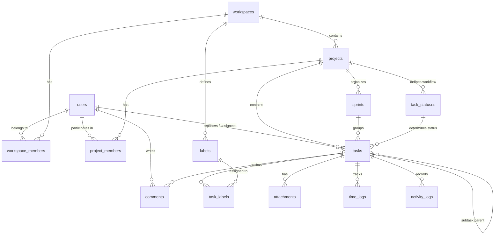

# Database Design Document - Project Management System

Tài liệu thiết kế Cơ sở Dữ liệu (Relational Database Schema) cho Hệ thống Quản lý Dự án (Project Management Application - tương tự Jira/Linear/ClickUp).

---

## 1. Tổng quan Đơn vị Thực thể (Core Entities)

1. **User & Auth**: Quản lý tài khoản, vai trò và phân quyền.
2. **Workspace**: Không gian làm việc chung của tổ chức/công ty.
3. **Project & Member**: Các dự án thuộc Workspace và danh sách thành viên tham gia.
4. **Sprint / Milestone**: Quản lý các chu kỳ sprint (Scrum/Agile) hoặc mốc dự án.
5. **Task & Subtask**: Công việc, phân loại, trạng thái, mức độ ưu tiên và người thực hiện.
6. **Task Status & Label**: Trạng thái tùy chỉnh theo dự án (Custom Workflow) và nhãn phân loại.
7. **Comment & Attachment**: Thảo luận chuỗi (Threaded comments) và tệp đính kèm.
8. **Activity Log & Time Tracking**: Ghi vết lịch sử thay đổi (Audit trail) và thời gian gian làm việc (Time log).

---

## 2. Sơ đồ Quan hệ Thực thể (Mermaid ERD)



---

## 3. Thiết kế Chi tiết Chi tiết Các Bảng (Data Dictionary)

### 3.1. Phân hệ Người dùng & Workspace

#### Bảng `users`

Lưu trữ thông tin người dùng trong hệ thống.

| Tên Cột         | Kiểu Dữ Liệu   | Ràng Buộc                                | Mô Tả                             |
| :-------------- | :------------- | :--------------------------------------- | :-------------------------------- |
| `id`            | `UUID`         | `PRIMARY KEY, DEFAULT gen_random_uuid()` | Định danh người dùng              |
| `email`         | `VARCHAR(255)` | `NOT NULL, UNIQUE`                       | Địa chỉ email đăng nhập           |
| `password_hash` | `VARCHAR(255)` | `NOT NULL`                               | Mật khẩu mã hóa (Bcrypt/Argon2)   |
| `full_name`     | `VARCHAR(100)` | `NOT NULL`                               | Họ và tên hiển thị                |
| `avatar_url`    | `TEXT`         | `NULL`                                   | Đường dẫn ảnh đại diện            |
| `timezone`      | `VARCHAR(50)`  | `DEFAULT 'UTC'`                          | Múi giờ người dùng                |
| `status`        | `VARCHAR(20)`  | `DEFAULT 'ACTIVE'`                       | `ACTIVE`, `INACTIVE`, `SUSPENDED` |
| `created_at`    | `TIMESTAMPTZ`  | `NOT NULL, DEFAULT NOW()`                | Thời điểm tạo                     |
| `updated_at`    | `TIMESTAMPTZ`  | `NOT NULL, DEFAULT NOW()`                | Thời điểm cập nhật cuối           |

#### Bảng `workspaces`

Không gian làm việc riêng rẽ cho mỗi công ty / tổ chức.

| Tên Cột      | Kiểu Dữ Liệu   | Ràng Buộc                                | Mô Tả                         |
| :----------- | :------------- | :--------------------------------------- | :---------------------------- |
| `id`         | `UUID`         | `PRIMARY KEY, DEFAULT gen_random_uuid()` | Định danh workspace           |
| `name`       | `VARCHAR(100)` | `NOT NULL`                               | Tên workspace                 |
| `slug`       | `VARCHAR(100)` | `NOT NULL, UNIQUE`                       | Đường dẫn URL slug (`my-org`) |
| `logo_url`   | `TEXT`         | `NULL`                                   | Logo của workspace            |
| `owner_id`   | `UUID`         | `NOT NULL, REFERENCES users(id)`         | Người sở hữu workspace        |
| `created_at` | `TIMESTAMPTZ`  | `NOT NULL, DEFAULT NOW()`                | Thời điểm tạo                 |
| `updated_at` | `TIMESTAMPTZ`  | `NOT NULL, DEFAULT NOW()`                | Thời điểm cập nhật            |

#### Bảng `workspace_members`

Phân quyền người dùng trong Workspace.

| Tên Cột        | Kiểu Dữ Liệu              | Ràng Buộc                                               | Mô Tả                               |
| :------------- | :------------------------ | :------------------------------------------------------ | :---------------------------------- |
| `workspace_id` | `UUID`                    | `NOT NULL, REFERENCES workspaces(id) ON DELETE CASCADE` | ID workspace                        |
| `user_id`      | `UUID`                    | `NOT NULL, REFERENCES users(id) ON DELETE CASCADE`      | ID người dùng                       |
| `role`         | `VARCHAR(20)`             | `NOT NULL, DEFAULT 'MEMBER'`                            | `OWNER`, `ADMIN`, `MEMBER`, `GUEST` |
| `joined_at`    | `TIMESTAMPTZ`             | `NOT NULL, DEFAULT NOW()`                               | Ngày tham gia                       |
| `PRIMARY KEY`  | `(workspace_id, user_id)` |                                                         | Khóa chính phức hợp                 |

---

### 3.2. Phân hệ Dự án & Sprint

#### Bảng `projects`

Danh sách dự án trong Workspace.

| Tên Cột        | Kiểu Dữ Liệu          | Ràng Buộc                                               | Mô Tả                                                    |
| :------------- | :-------------------- | :------------------------------------------------------ | :------------------------------------------------------- |
| `id`           | `UUID`                | `PRIMARY KEY, DEFAULT gen_random_uuid()`                | Định danh dự án                                          |
| `workspace_id` | `UUID`                | `NOT NULL, REFERENCES workspaces(id) ON DELETE CASCADE` | Thuộc Workspace nào                                      |
| `key`          | `VARCHAR(10)`         | `NOT NULL`                                              | Mã viết tắt tiền tố task (VD: `PRJ`, `CORE`)             |
| `name`         | `VARCHAR(150)`        | `NOT NULL`                                              | Tên dự án                                                |
| `description`  | `TEXT`                | `NULL`                                                  | Mô tả chi tiết dự án                                     |
| `lead_id`      | `UUID`                | `NULL, REFERENCES users(id)`                            | Trưởng dự án (Project Lead)                              |
| `status`       | `VARCHAR(20)`         | `DEFAULT 'ACTIVE'`                                      | `PLANNING`, `ACTIVE`, `ON_HOLD`, `COMPLETED`, `ARCHIVED` |
| `created_at`   | `TIMESTAMPTZ`         | `NOT NULL, DEFAULT NOW()`                               | Thời điểm tạo                                            |
| `updated_at`   | `TIMESTAMPTZ`         | `NOT NULL, DEFAULT NOW()`                               | Thời điểm cập nhật                                       |
| `UNIQUE`       | `(workspace_id, key)` |                                                         | Mã `key` không trùng trong cùng 1 workspace              |

#### Bảng `project_members`

Thành viên trực thuộc từng dự án.

| Tên Cột       | Kiểu Dữ Liệu            | Ràng Buộc                                             | Mô Tả                                 |
| :------------ | :---------------------- | :---------------------------------------------------- | :------------------------------------ |
| `project_id`  | `UUID`                  | `NOT NULL, REFERENCES projects(id) ON DELETE CASCADE` | ID dự án                              |
| `user_id`     | `UUID`                  | `NOT NULL, REFERENCES users(id) ON DELETE CASCADE`    | ID người dùng                         |
| `role`        | `VARCHAR(20)`           | `NOT NULL, DEFAULT 'DEVELOPER'`                       | `PROJECT_LEAD`, `DEVELOPER`, `VIEWER` |
| `PRIMARY KEY` | `(project_id, user_id)` |                                                       | Khóa chính phức hợp                   |

#### Bảng `sprints`

Các đợt Sprint theo mô hình Agile / Scrum.

| Tên Cột      | Kiểu Dữ Liệu   | Ràng Buộc                                             | Mô Tả                            |
| :----------- | :------------- | :---------------------------------------------------- | :------------------------------- |
| `id`         | `UUID`         | `PRIMARY KEY, DEFAULT gen_random_uuid()`              | ID Sprint                        |
| `project_id` | `UUID`         | `NOT NULL, REFERENCES projects(id) ON DELETE CASCADE` | ID dự án                         |
| `name`       | `VARCHAR(100)` | `NOT NULL`                                            | Tên Sprint (VD: `Sprint 1`)      |
| `goal`       | `TEXT`         | `NULL`                                                | Mục tiêu của Sprint              |
| `start_date` | `TIMESTAMPTZ`  | `NULL`                                                | Ngày bắt đầu dự kiến             |
| `end_date`   | `TIMESTAMPTZ`  | `NULL`                                                | Ngày kết thúc dự kiến            |
| `status`     | `VARCHAR(20)`  | `DEFAULT 'PLANNED'`                                   | `PLANNED`, `ACTIVE`, `COMPLETED` |
| `created_at` | `TIMESTAMPTZ`  | `NOT NULL, DEFAULT NOW()`                             | Thời điểm tạo                    |

---

### 3.3. Phân hệ Workflow & Task (Công việc)

#### Bảng `task_statuses`

Trạng thái cột công việc (Custom Workflow cho từng dự án).

| Tên Cột      | Kiểu Dữ Liệu  | Ràng Buộc                                             | Mô Tả                                          |
| :----------- | :------------ | :---------------------------------------------------- | :--------------------------------------------- |
| `id`         | `UUID`        | `PRIMARY KEY, DEFAULT gen_random_uuid()`              | ID trạng thái                                  |
| `project_id` | `UUID`        | `NOT NULL, REFERENCES projects(id) ON DELETE CASCADE` | ID dự án                                       |
| `name`       | `VARCHAR(50)` | `NOT NULL`                                            | Tên cột (VD: `Backlog`, `In Progress`, `Done`) |
| `category`   | `VARCHAR(20)` | `NOT NULL`                                            | `TODO`, `IN_PROGRESS`, `DONE`, `CANCELLED`     |
| `position`   | `INT`         | `NOT NULL, DEFAULT 0`                                 | Thứ tự hiển thị trên Kanban board              |
| `color`      | `VARCHAR(20)` | `DEFAULT '#6B7280'`                                   | Mã màu hiển thị                                |

#### Bảng `tasks`

Bảng cốt lõi lưu trữ mọi công việc / issue / subtask.

| Tên Cột          | Kiểu Dữ Liệu                | Ràng Buộc                                             | Mô Tả                                                |
| :--------------- | :-------------------------- | :---------------------------------------------------- | :--------------------------------------------------- |
| `id`             | `UUID`                      | `PRIMARY KEY, DEFAULT gen_random_uuid()`              | ID duy nhất của Task                                 |
| `project_id`     | `UUID`                      | `NOT NULL, REFERENCES projects(id) ON DELETE CASCADE` | Thuộc dự án nào                                      |
| `sprint_id`      | `UUID`                      | `NULL, REFERENCES sprints(id) ON DELETE SET NULL`     | Thuộc Sprint nào (có thể null nếu ở Backlog)         |
| `parent_id`      | `UUID`                      | `NULL, REFERENCES tasks(id) ON DELETE CASCADE`        | ID task cha (nếu đây là subtask)                     |
| `status_id`      | `UUID`                      | `NOT NULL, REFERENCES task_statuses(id)`              | Trạng thái công việc hiện tại                        |
| `task_number`    | `INT`                       | `NOT NULL`                                            | Số thứ tự tự tăng trong dự án (VD: 101 -> `PRJ-101`) |
| `title`          | `VARCHAR(255)`              | `NOT NULL`                                            | Tiêu đề công việc                                    |
| `description`    | `TEXT`                      | `NULL`                                                | Mô tả chi tiết (Markdown/HTML)                       |
| `priority`       | `VARCHAR(20)`               | `DEFAULT 'MEDIUM'`                                    | `LOW`, `MEDIUM`, `HIGH`, `URGENT`                    |
| `reporter_id`    | `UUID`                      | `NOT NULL, REFERENCES users(id)`                      | Người giao / tạo task                                |
| `assignee_id`    | `UUID`                      | `NULL, REFERENCES users(id)`                          | Người chịu trách nhiệm thực hiện                     |
| `estimate_hours` | `NUMERIC(5,2)`              | `NULL`                                                | Ước tính số giờ hoàn thành                           |
| `due_date`       | `TIMESTAMPTZ`               | `NULL`                                                | Hạn chót hoàn thành                                  |
| `position`       | `DOUBLE PRECISION`          | `NOT NULL, DEFAULT 0`                                 | Vị trí sắp xếp kéo thả (Lexorank/Float)              |
| `created_at`     | `TIMESTAMPTZ`               | `NOT NULL, DEFAULT NOW()`                             | Thời điểm tạo                                        |
| `updated_at`     | `TIMESTAMPTZ`               | `NOT NULL, DEFAULT NOW()`                             | Thời điểm cập nhật                                   |
| `deleted_at`     | `TIMESTAMPTZ`               | `NULL`                                                | Thùng rác (Soft Delete)                              |
| `UNIQUE`         | `(project_id, task_number)` |                                                       | Mã định danh đẹp không trùng `PRJ-101`               |

#### Bảng `labels` & `task_labels`

Nhãn đánh dấu phân loại công việc.

```sql
CREATE TABLE labels (
    id UUID PRIMARY KEY DEFAULT gen_random_uuid(),
    workspace_id UUID NOT NULL REFERENCES workspaces(id) ON DELETE CASCADE,
    name VARCHAR(50) NOT NULL,
    color VARCHAR(20) NOT NULL DEFAULT '#3B82F6',
    created_at TIMESTAMPTZ NOT NULL DEFAULT NOW()
);

CREATE TABLE task_labels (
    task_id UUID NOT NULL REFERENCES tasks(id) ON DELETE CASCADE,
    label_id UUID NOT NULL REFERENCES labels(id) ON DELETE CASCADE,
    PRIMARY KEY (task_id, label_id)
);
```

---

### 3.4. Phân hệ Thảo luận & Tệp đính kèm

#### Bảng `comments`

Bình luận thảo luận dưới mỗi Task (hỗ trợ trả lời theo cây/thread).

| Tên Cột      | Kiểu Dữ Liệu  | Ràng Buộc                                          | Mô Tả                                 |
| :----------- | :------------ | :------------------------------------------------- | :------------------------------------ |
| `id`         | `UUID`        | `PRIMARY KEY, DEFAULT gen_random_uuid()`           | ID bình luận                          |
| `task_id`    | `UUID`        | `NOT NULL, REFERENCES tasks(id) ON DELETE CASCADE` | ID task tương ứng                     |
| `author_id`  | `UUID`        | `NOT NULL, REFERENCES users(id)`                   | Tác giả bình luận                     |
| `parent_id`  | `UUID`        | `NULL, REFERENCES comments(id) ON DELETE CASCADE`  | Bình luận cha (cho dạng reply thread) |
| `content`    | `TEXT`        | `NOT NULL`                                         | Nội dung bình luận (Rich text)        |
| `created_at` | `TIMESTAMPTZ` | `NOT NULL, DEFAULT NOW()`                          | Thời gian viết                        |
| `updated_at` | `TIMESTAMPTZ` | `NOT NULL, DEFAULT NOW()`                          | Thời gian sửa                         |

#### Bảng `attachments`

Tệp tin đính kèm liên kết với Task hoặc Comment.

| Tên Cột       | Kiểu Dữ Liệu   | Ràng Buộc                                          | Mô Tả                                           |
| :------------ | :------------- | :------------------------------------------------- | :---------------------------------------------- |
| `id`          | `UUID`         | `PRIMARY KEY, DEFAULT gen_random_uuid()`           | ID tệp                                          |
| `task_id`     | `UUID`         | `NOT NULL, REFERENCES tasks(id) ON DELETE CASCADE` | Đính kèm ở task nào                             |
| `uploader_id` | `UUID`         | `NOT NULL, REFERENCES users(id)`                   | Người tải lên                                   |
| `file_name`   | `VARCHAR(255)` | `NOT NULL`                                         | Tên gốc của tệp                                 |
| `file_url`    | `TEXT`         | `NOT NULL`                                         | Đường dẫn S3/Cloud Storage                      |
| `file_size`   | `BIGINT`       | `NOT NULL`                                         | Kích thước tệp (bytes)                          |
| `mime_type`   | `VARCHAR(100)` | `NOT NULL`                                         | Loại định dạng (`image/png`, `application/pdf`) |
| `created_at`  | `TIMESTAMPTZ`  | `NOT NULL, DEFAULT NOW()`                          | Thời gian tải lên                               |

---

### 3.5. Phân hệ Nhật ký & Ghi nhận thời gian

#### Bảng `time_logs`

Ghi nhận số giờ làm việc thực tế cho Task.

| Tên Cột       | Kiểu Dữ Liệu   | Ràng Buộc                                          | Mô Tả                    |
| :------------ | :------------- | :------------------------------------------------- | :----------------------- |
| `id`          | `UUID`         | `PRIMARY KEY, DEFAULT gen_random_uuid()`           | ID log                   |
| `task_id`     | `UUID`         | `NOT NULL, REFERENCES tasks(id) ON DELETE CASCADE` | Task được log giờ        |
| `user_id`     | `UUID`         | `NOT NULL, REFERENCES users(id)`                   | Người log giờ            |
| `hours_spent` | `NUMERIC(5,2)` | `NOT NULL CHECK (hours_spent > 0)`                 | Số giờ đã làm            |
| `work_date`   | `DATE`         | `NOT NULL DEFAULT CURRENT_DATE`                    | Ngày thực hiện công việc |
| `description` | `TEXT`         | `NULL`                                             | Ghi chú công việc đã làm |
| `created_at`  | `TIMESTAMPTZ`  | `NOT NULL, DEFAULT NOW()`                          | Ngày tạo bản ghi         |

#### Bảng `activity_logs`

Audit trail lưu toàn bộ lịch sử thay đổi công việc.

| Tên Cột      | Kiểu Dữ Liệu  | Ràng Buộc                                          | Mô Tả                                                    |
| :----------- | :------------ | :------------------------------------------------- | :------------------------------------------------------- |
| `id`         | `UUID`        | `PRIMARY KEY, DEFAULT gen_random_uuid()`           | ID log                                                   |
| `task_id`    | `UUID`        | `NOT NULL, REFERENCES tasks(id) ON DELETE CASCADE` | Task bị tác động                                         |
| `actor_id`   | `UUID`        | `NOT NULL, REFERENCES users(id)`                   | Người thực hiện hành động                                |
| `action`     | `VARCHAR(50)` | `NOT NULL`                                         | `STATUS_CHANGED`, `ASSIGNEE_CHANGED`, `PRIORITY_UPDATED` |
| `changes`    | `JSONB`       | `NOT NULL`                                         | Lưu dạng diff: `{"old": "TODO", "new": "DONE"}`          |
| `created_at` | `TIMESTAMPTZ` | `NOT NULL, DEFAULT NOW()`                          | Thời điểm diễn ra                                        |

---

## 4. Chỉ mục Index & Tối ưu hiệu năng (Performance Indexing)

Đề xuất các chỉ mục Index quan trọng để truy vấn bảng Kanban board và danh sách công việc cực nhanh:

```sql
-- 1. Index cho truy vấn danh sách task theo dự án & trạng thái (màn hình Kanban Board)
CREATE INDEX idx_tasks_project_status ON tasks(project_id, status_id) WHERE deleted_at IS NULL;

-- 2. Index cho truy vấn task theo Sprint
CREATE INDEX idx_tasks_sprint ON tasks(sprint_id) WHERE deleted_at IS NULL;

-- 3. Index hỗ trợ lọc task của tôi (My Tasks / Assignee)
CREATE INDEX idx_tasks_assignee ON tasks(assignee_id) WHERE deleted_at IS NULL;

-- 4. Index hỗ trợ sắp xếp vị trí kéo thả (Kanban drag-and-drop order)
CREATE INDEX idx_tasks_position ON tasks(status_id, position ASC);

-- 5. Index tra cứu nhanh mã issue (VD: PRJ-101)
CREATE UNIQUE INDEX idx_tasks_project_number ON tasks(project_id, task_number);

-- 6. Index truy vấn Activity Log theo Task
CREATE INDEX idx_activity_logs_task ON activity_logs(task_id, created_at DESC);
```

---

## 5. Điểm thảo luận & Review dành cho bạn (Review Points)

> [!IMPORTANT]
> Hãy xem xét và cho ý kiến phản hồi chi tiết về các câu hỏi thiết kế sau:

1. **Multi-assignees**: Hiện tại thiết kế 1 task chỉ có 1 `assignee_id` chính (theo phong cách Jira/Linear). Dự án của bạn muốn 1 task có 1 người làm hay cho phép phân công **nhiều người (Multiple Assignees)**?
2. **Subtask nesting**: Thiết kế đang dùng tự tham chiếu `parent_id` trong bảng `tasks` (cho phép làm subtask n-cấp). Bạn có muốn giới hạn chỉ 1 cấp subtask hay n-cấp?
3. **Lexorank Drag-and-drop**: Thuộc tính `position` dạng `DOUBLE PRECISION` phục vụ tính toán lại thứ tự khi kéo thả trên Kanban Board mà không phải re-index toàn bộ bảng. Bạn có muốn đổi sang chuỗi Lexorank string không?
4. **Soft Delete**: Bảng `tasks` sử dụng cột `deleted_at` để khôi phục khi lỡ xóa nhầm. Các bảng khác có cần soft delete không?
