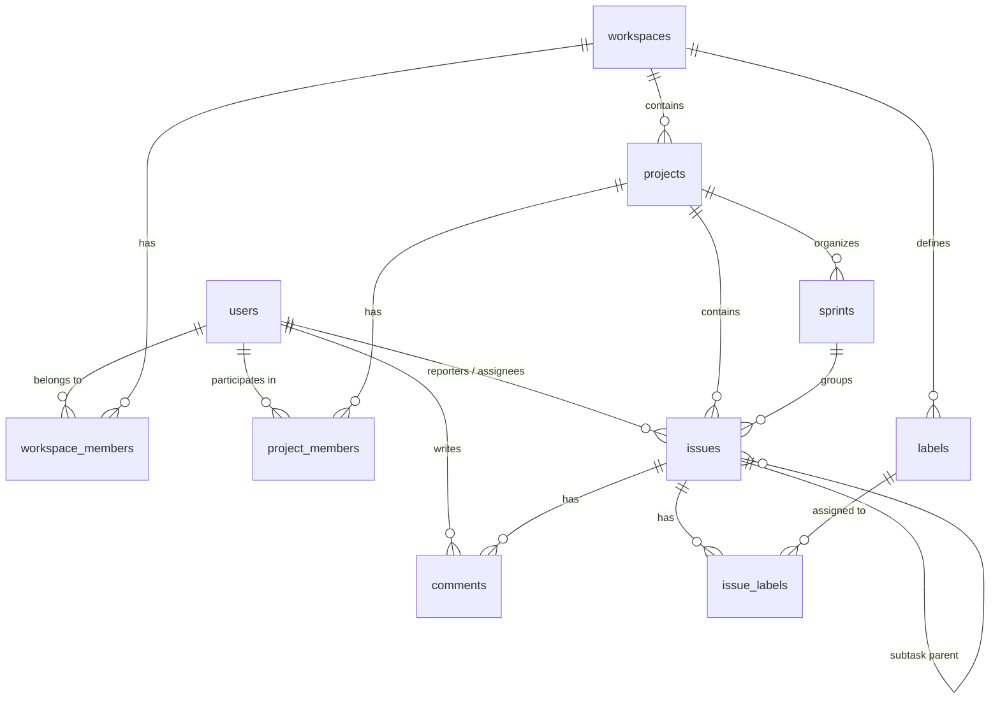

# Database Design Document - Project Management System

Tài liệu thiết kế Cơ sở Dữ liệu (Relational Database Schema) cho Hệ thống Quản lý Dự án.

---

## 1. Tổng quan Đơn vị Thực thể (Core Entities)

1. **User & Auth**: Quản lý tài khoản, liên kết chặt chẽ với Supabase `auth.users`.
2. **Workspace**: Không gian làm việc chung của tổ chức/công ty.
3. **Project & Member**: Các dự án thuộc Workspace, thành viên tham gia và project counter `next_issue_number`.
4. **Sprint / Milestone**: Quản lý các chu kỳ sprint (Scrum/Agile).
5. **Issue & Subtask**: Đơn vị công việc trung tâm (thay thế cho `tasks`), sử dụng status và priority dạng literal string.
6. **Label & Issue Label**: Nhãn phân loại cấp workspace và bảng quan hệ nhiều-nhiều `issue_labels`.
7. **Comment**: Thảo luận chuỗi liên kết trực tiếp với `issues`.
8. **Private Schema & Security**: Các helper authorization nội bộ và RPC transaction-safe `create_issue`.

---

## 2. Sơ đồ Quan hệ Thực thể (Mermaid ERD)



---

## 3. Thiết kế Chi tiết Các Bảng (Data Dictionary)

### 3.1. Phân hệ Người dùng & Workspace

#### Bảng `users`

Được tự động đồng bộ từ `auth.users` qua trigger `handle_new_auth_user()`.

| Tên Cột | Kiểu Dữ Liệu | Ràng Buộc | Mô Tả |
| :--- | :--- | :--- | :--- |
| `id` | `UUID` | `PRIMARY KEY, REFERENCES auth.users(id) ON DELETE CASCADE` | Định danh người dùng |
| `username` | `VARCHAR(100)` | `NOT NULL` | Tên người dùng hiển thị |
| `avatar_url` | `TEXT` | `NULL` | Đường dẫn ảnh đại diện |
| `status` | `VARCHAR(20)` | `NOT NULL DEFAULT 'ACTIVE'` | `ACTIVE`, `INACTIVE`, `SUSPENDED` |
| `created_at` | `TIMESTAMPTZ` | `NOT NULL, DEFAULT NOW()` | Thời điểm tạo |
| `updated_at` | `TIMESTAMPTZ` | `NOT NULL, DEFAULT NOW()` | Thời điểm cập nhật |

#### Bảng `workspaces`

Không gian làm việc riêng rẽ cho mỗi công ty / tổ chức.

| Tên Cột | Kiểu Dữ Liệu | Ràng Buộc | Mô Tả |
| :--- | :--- | :--- | :--- |
| `id` | `UUID` | `PRIMARY KEY, DEFAULT gen_random_uuid()` | Định danh workspace |
| `name` | `VARCHAR(100)` | `NOT NULL` | Tên workspace |
| `slug` | `VARCHAR(100)` | `NOT NULL, UNIQUE` | Slug URL duy nhất |
| `logo_url` | `TEXT` | `NULL` | Logo workspace |
| `owner_id` | `UUID` | `NOT NULL, REFERENCES users(id)` | Người sở hữu workspace |
| `created_at` | `TIMESTAMPTZ` | `NOT NULL, DEFAULT NOW()` | Thời điểm tạo |
| `updated_at` | `TIMESTAMPTZ` | `NOT NULL, DEFAULT NOW()` | Thời điểm cập nhật |

#### Bảng `workspace_members`

Phân quyền người dùng trong Workspace.

| Tên Cột | Kiểu Dữ Liệu | Ràng Buộc | Mô Tả |
| :--- | :--- | :--- | :--- |
| `workspace_id` | `UUID` | `NOT NULL, REFERENCES workspaces(id) ON DELETE CASCADE` | ID workspace |
| `user_id` | `UUID` | `NOT NULL, REFERENCES users(id) ON DELETE CASCADE` | ID người dùng |
| `role` | `VARCHAR(20)` | `NOT NULL, DEFAULT 'MEMBER' CHECK (role IN ('OWNER', 'ADMIN', 'MEMBER'))` | Vai trò trong workspace |
| `joined_at` | `TIMESTAMPTZ` | `NOT NULL, DEFAULT NOW()` | Ngày tham gia |
| `PRIMARY KEY` | `(workspace_id, user_id)` | | Khóa chính phức hợp |

---

### 3.2. Phân hệ Dự án & Thành viên

#### Bảng `projects`

Danh sách dự án trong Workspace, quản lý counter issue tự tăng cấp dự án.

| Tên Cột | Kiểu Dữ Liệu | Ràng Buộc | Mô Tả |
| :--- | :--- | :--- | :--- |
| `id` | `UUID` | `PRIMARY KEY, DEFAULT gen_random_uuid()` | Định danh dự án |
| `workspace_id` | `UUID` | `NOT NULL, REFERENCES workspaces(id) ON DELETE CASCADE` | Thuộc Workspace nào |
| `key` | `VARCHAR(10)` | `NOT NULL` | Mã tiền tố issue (VD: `QUA`, `CORE`) |
| `name` | `VARCHAR(150)` | `NOT NULL` | Tên dự án |
| `description` | `TEXT` | `NULL` | Mô tả dự án |
| `lead_id` | `UUID` | `NULL, REFERENCES users(id) ON DELETE SET NULL` | Project Lead |
| `status` | `VARCHAR(20)` | `NOT NULL DEFAULT 'ACTIVE' CHECK (status IN ('PLANNING', 'ACTIVE', 'ON_HOLD', 'COMPLETED', 'ARCHIVED'))` | Trạng thái dự án |
| `next_issue_number` | `INTEGER` | `NOT NULL DEFAULT 1` | Counter cấp phát số thứ tự issue tiếp theo |
| `created_at` | `TIMESTAMPTZ` | `NOT NULL, DEFAULT NOW()` | Thời điểm tạo |
| `updated_at` | `TIMESTAMPTZ` | `NOT NULL, DEFAULT NOW()` | Thời điểm cập nhật |
| `UNIQUE` | `(workspace_id, key)` | | Khóa duy nhất theo workspace |

#### Bảng `project_members`

Thành viên trực thuộc từng dự án.

| Tên Cột | Kiểu Dữ Liệu | Ràng Buộc | Mô Tả |
| :--- | :--- | :--- | :--- |
| `project_id` | `UUID` | `NOT NULL, REFERENCES projects(id) ON DELETE CASCADE` | ID dự án |
| `user_id` | `UUID` | `NOT NULL, REFERENCES users(id) ON DELETE CASCADE` | ID người dùng |
| `role` | `VARCHAR(20)` | `NOT NULL, DEFAULT 'MEMBER' CHECK (role IN ('LEAD', 'MEMBER'))` | Vai trò trong dự án |
| `joined_at` | `TIMESTAMPTZ` | `NOT NULL, DEFAULT NOW()` | Ngày tham gia |
| `PRIMARY KEY` | `(project_id, user_id)` | | Khóa chính phức hợp |

---

### 3.3. Phân hệ Issues & Labels

#### Bảng `issues`

Bảng cốt lõi quản lý công việc (thay thế cho `tasks`).

| Tên Cột | Kiểu Dữ Liệu | Ràng Buộc | Mô Tả |
| :--- | :--- | :--- | :--- |
| `id` | `UUID` | `PRIMARY KEY, DEFAULT gen_random_uuid()` | Định danh UUID của Issue |
| `project_id` | `UUID` | `NOT NULL, REFERENCES projects(id) ON DELETE CASCADE` | Thuộc dự án nào |
| `sprint_id` | `UUID` | `NULL, REFERENCES sprints(id) ON DELETE SET NULL` | Thuộc Sprint nào |
| `parent_id` | `UUID` | `NULL, REFERENCES issues(id) ON DELETE CASCADE` | Issue cha (cho sub-issue) |
| `issue_number` | `INT` | `NOT NULL` | Số thứ tự trong dự án (VD: 12 -> `QUA-12`) |
| `title` | `VARCHAR(255)` | `NOT NULL` | Tiêu đề issue |
| `description` | `TEXT` | `NULL` | Nội dung mô tả chi tiết |
| `status` | `VARCHAR(20)` | `NOT NULL DEFAULT 'backlog' CHECK (status IN ('backlog', 'todo', 'in_progress', 'done', 'canceled'))` | Trạng thái cố định |
| `priority` | `VARCHAR(20)` | `NOT NULL DEFAULT 'no_priority' CHECK (priority IN ('no_priority', 'urgent', 'high', 'medium', 'low'))` | Mức độ ưu tiên |
| `reporter_id` | `UUID` | `NOT NULL, REFERENCES users(id) ON DELETE RESTRICT` | Người tạo issue (gán từ `auth.uid()`) |
| `assignee_id` | `UUID` | `NULL, REFERENCES users(id) ON DELETE SET NULL` | Người được giao việc |
| `due_date` | `TIMESTAMPTZ` | `NULL` | Hạn hoàn thành |
| `position` | `DOUBLE PRECISION` | `NOT NULL DEFAULT 0` | Thứ tự kéo thả |
| `created_at` | `TIMESTAMPTZ` | `NOT NULL DEFAULT NOW()` | Thời điểm tạo |
| `updated_at` | `TIMESTAMPTZ` | `NOT NULL DEFAULT NOW()` | Thời điểm cập nhật |
| `deleted_at` | `TIMESTAMPTZ` | `NULL` | Thời điểm xóa mềm (Soft Delete) |
| `UNIQUE` | `(project_id, issue_number)` | | Đảm bảo định danh duy nhất theo dự án |

#### Bảng `labels` & `issue_labels`

Nhãn đánh dấu và phân loại issue.

```sql
CREATE TABLE labels (
    id UUID PRIMARY KEY DEFAULT gen_random_uuid(),
    workspace_id UUID NOT NULL REFERENCES workspaces(id) ON DELETE CASCADE,
    name VARCHAR(50) NOT NULL,
    color VARCHAR(20) NOT NULL DEFAULT '#3B82F6',
    created_at TIMESTAMPTZ NOT NULL DEFAULT NOW()
);

CREATE TABLE issue_labels (
    issue_id UUID NOT NULL REFERENCES issues(id) ON DELETE CASCADE,
    label_id UUID NOT NULL REFERENCES labels(id) ON DELETE CASCADE,
    PRIMARY KEY (issue_id, label_id)
);
```

---

### 3.4. Thảo luận (Comments)

#### Bảng `comments`

Bình luận thảo luận dưới mỗi Task (hỗ trợ trả lời theo cây/thread).

| Tên Cột | Kiểu Dữ Liệu | Ràng Buộc | Mô Tả |
| :--- | :--- | :--- | :--- |
| `id` | `UUID` | `PRIMARY KEY, DEFAULT gen_random_uuid()` | ID bình luận |
| `issue_id` | `UUID` | `NOT NULL, REFERENCES issues(id) ON DELETE CASCADE` | Liên kết Issue |
| `author_id` | `UUID` | `NOT NULL, REFERENCES users(id)` | Tác giả |
| `content` | `TEXT` | `NOT NULL` | Nội dung bình luận |
| `created_at` | `TIMESTAMPTZ` | `NOT NULL, DEFAULT NOW()` | Thời gian tạo |
| `updated_at` | `TIMESTAMPTZ` | `NOT NULL, DEFAULT NOW()` | Thời gian sửa |

---

## 4. Kiến trúc Bảo mật & Mutation Boundary

### 4.1. Khóa Quyền Direct Mutation trên `issues`
Để triệt tiêu nguy cơ privilege escalation ở cấp cột (`project_id`, `reporter_id`, `issue_number`, `deleted_at`):
- Toàn bộ quyền direct `INSERT`, `UPDATE`, `DELETE` trên bảng `issues` bị thu hồi từ role `authenticated`.
- Người dùng chỉ có quyền `SELECT` qua RLS Policy (`deleted_at IS NULL AND private.is_project_member(project_id)`).

### 4.2. Schema `private` (Defense-in-depth)
Chứa các authorization helper functions nội bộ, không lộ ra PostgREST API công khai:
- `private.is_workspace_member(p_workspace_id UUID)`
- `private.is_project_member(p_project_id UUID)`
- `private.can_manage_project(p_project_id UUID)`
Tất cả hàm đều được gắn `SECURITY DEFINER SET search_path = ''` và thu hồi quyền `EXECUTE` trực tiếp từ `PUBLIC, anon, authenticated`.

### 4.3. Transaction-safe RPC `public.create_issue`
Cổng mutation duy nhất phục vụ tạo issue:
1. Xác thực `v_reporter_id := auth.uid()`.
2. Tự authorize quyền thành viên dự án (`private.is_project_member(p_project_id)`).
3. Validate đầu vào: `BTRIM(title)`, trạng thái, mức độ ưu tiên.
4. Kiểm tra invariants: `assignee_id` phải thuộc `project_members`, `label_ids` phải thuộc cùng `workspace_id`.
5. Khóa row project `SELECT next_issue_number FROM projects WHERE id = p_project_id FOR UPDATE`, cấp phát số tuần tự và tăng counter.
6. Insert vào `issues` và `issue_labels` (deduplicate bằng `SELECT DISTINCT`).
7. Trả về row issue vừa tạo; toàn bộ quá trình được đóng gói trong một transaction ACID.

---

## 5. Performance Indexing

```sql
-- 1. Index truy vấn danh sách issue theo dự án và trạng thái (Kanban board / list)
CREATE INDEX idx_issues_project_status ON issues(project_id, status) WHERE deleted_at IS NULL;

-- 2. Index truy vấn issue theo Sprint
CREATE INDEX idx_issues_sprint ON issues(sprint_id) WHERE deleted_at IS NULL;

-- 3. Index hỗ trợ lọc My Issues
CREATE INDEX idx_issues_assignee ON issues(assignee_id) WHERE deleted_at IS NULL;

-- 4. Index sắp xếp vị trí kéo thả
CREATE INDEX idx_issues_position ON issues(status, position ASC) WHERE deleted_at IS NULL;

-- 5. Index truy vấn comment theo Issue
CREATE INDEX idx_comments_issue ON comments(issue_id, created_at ASC);
```
